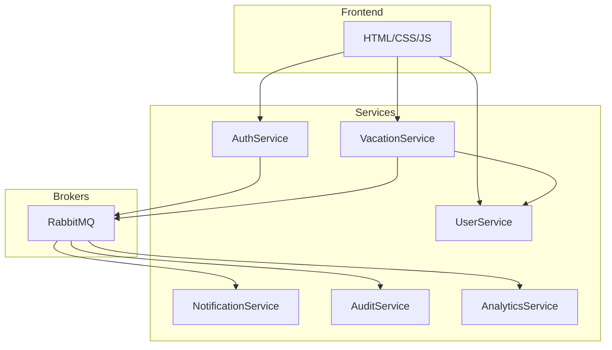

# Практична робота №3

**Виконали:** ІП-з31 Семен Прохода, Арсен Потеряйко

**Тема:** Мікросервісна архітектура.

**Мета:** Застосувати мікросервісну архітектуру для проектування складних систем.

## Завдання:

### 1. Між-сервісна взаємодія:

#### a. Визначити які сервіси між собою спілкуються синхронно.

- Frontend &harr; AuthService – логін, реєстрація користувача
- Frontend &harr; VacationService – створення/перегляд заявок на відпустку
- Frontend &harr; UserService – отримання/оновлення даних про користувача
- Manager &harr; VacationService – затвердження або відхилення запиту
- Admin &harr; UserService – додавання/видалення користувачів, зміна ролей

#### b. Визначити які сервіси між собою спілкуються асинхронно, за допомогою RabbitMQ

- VacationService &rarr; NotificationService – надсилання повідомлень після зміни статусу заявки
- AuthService &rarr; AuditService – логування авторизаційних подій
- VacationService &rarr; AnalyticsService – надсилання подій для аналітики

### 2. Робота з даними.

#### a. Визначити, який патерн використовується для роботи з базою даних (db per service or shared db)

**DB per Service** – кожен сервіс має власну БД.

| Сервіс              | База даних       |
| ------------------- | ---------------- |
| AuthService         | auth_db          |
| UserService         | users_db         |
| VacationService     | vacations_db     |
| NotificationService | notifications_db |
| AnalyticsService    | analytics_db     |
| AuditService        | audit_db         |

#### b. Визначити, як накачуються міграційні скрипти для бази даних.

- Інструмент: **Alembic** (для FastAPI)
- Автоматичне застосування в CI/CD під час деплойменту контейнера

#### c. Визначити, як саме відбувається синхронізація даних між сервісами.

- **Event-driven architecture** через RabbitMQ
- Використовується підхід **eventual consistency**

### 3. Оновити діаграми, зобразити всі зв’язки між сервісами.

**Архітектура мікросервісів:**

### 4. Вказати, які саме патерни для мікросервісної архітектури використовуються.

| Категорія     | Патерн                     | Опис                                                   |
| ------------- | -------------------------- | ------------------------------------------------------ |
| Архітектура   | **Microservices**          | Поділ на незалежні сервіси за функціями                |
| Взаємодія     | **API Gateway (Frontend)** | Один вхід до системи                                   |
| База даних    | **Database per Service**   | Ізольовані бази для кожного сервісу                    |
| Події         | **Event-driven**           | RabbitMQ для комунікації між сервісами                 |
| Стабільність  | **Circuit Breaker**        | Захист від каскадних збоїв (через async timeout)       |
| Безпека       | **JWT Authentication**     | Авторизація через токени                               |
| Синхронізація | **Eventual Consistency**   | Дані між сервісами узгоджуються асинхронно через події |
