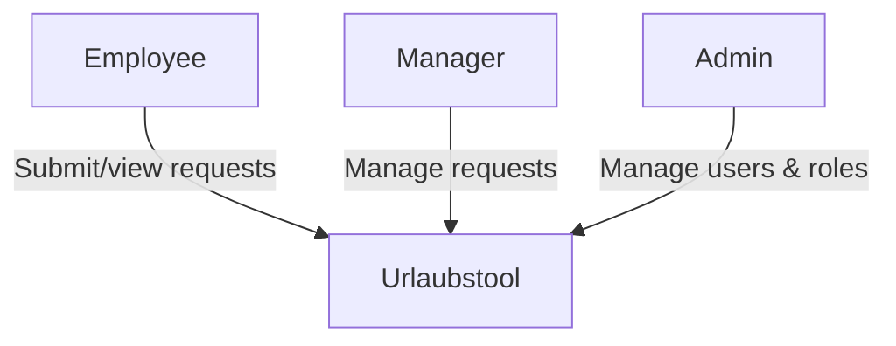
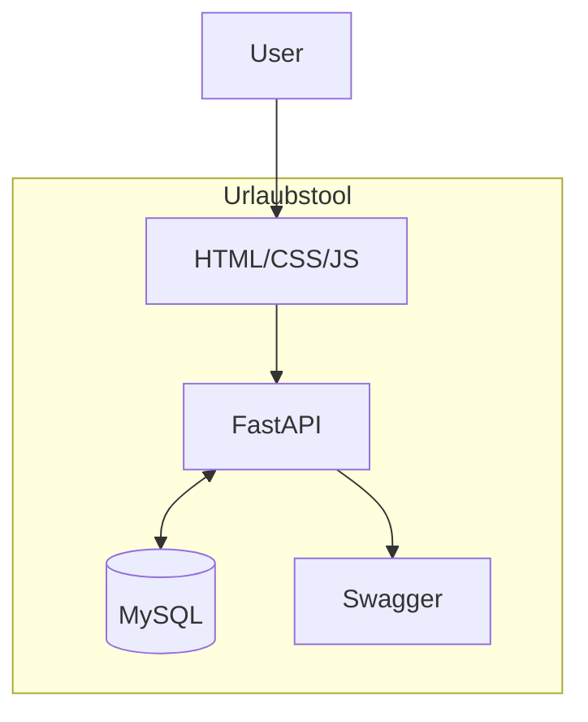
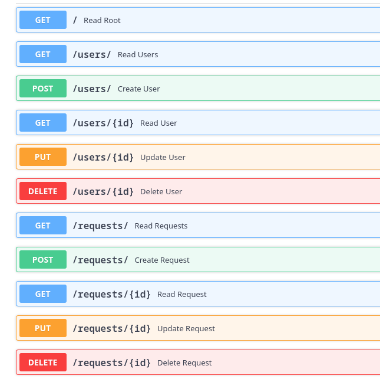

# Практична робота №2

**Виконали:** ІП-з31 Семен Прохода, Арсен Потеряйко

**Тема:** Формування та документація технічних рішень додатку. (System/Software design)

**Мета:** Навчитись формувати та документувати базові технічні рішення з архітектури додатку, зокрема, основні компоненти (сервіси), зв’язки між компонентами, дизайн API.

## Завдання:

### 1. Нефункціональні вимоги

| Атрибут         | Source    | Stimulus                  | Artifact         | Environment      | Response               | Measure                |
| --------------- | --------- | ------------------------- | ---------------- | ---------------- | ---------------------- | ---------------------- |
| **Performance**     | User      | Запит на створення заявки | API              | Робочий час      | Обробка запиту         | ≤ 2 с                  |
| **Security**        | Attacker  | Спроба несанкц. доступу   | Дані користувача | Будь-коли        | Блокування і логування | Жодного витоку даних   |
| **Modifiability**   | Developer | Зміна в API               | Код              | Під час розробки | Зміни ізоляовані       | ≤ 3 файли              |
| **Reliability**     | User      | Повторний запит           | Сховище заявок   | Нормальний режим | Один запис створюється | Жодних дублів          |
| **Availability**    | User      | Запит до системи          | API/Web          | Робочий час      | Доступна відповідь     | ≥ 99.9% uptime         |
| **Usability**       | New user  | Перше використання        | UI               | Браузер          | Успішне подання заявки | ≤ 2 хв, без помилок    |
| **Testability**     | Tester    | Запуск автотестів         | Кодова база      | CI/CD            | Тести проходять        | ≥ 80% покриття, ≤ 2 хв |
| **Maintainability** | Developer | Баг-репорт                | Код              | Робочий час      | Виправлення ізоляоване | ≤ 1 година             |

### 2. Архітектура системи та архітектурні рішення





### 3. API design guidelines

1. **Протокол:** HTTP
2. **Формат:** JSON
3. **Організація ресурсів:**
    - GET `/users/`
    - POST `/users/`
    - GET, PUT, DELETE `/users/{id}`
    - GET `/requests/`
    - POST `/requests/`
    - GET, PUT, DELETE `/requests/{id}`
4. **Правила іменування:** snake_case
5. **Версіонування:** `/v1/`
6. **Методи HTTP:**
    - GET
    - POST
    - PUT
    - DELETE
7. **Формати запитів та відповідей**

    - **HTTP GET**  
    Отримання ресурсу або списку ресурсів. Дані передаються через query-параметри.
            **Приклад запиту:**

            GET /users?limit=10&offset=0&sort=name:asc

        **Приклад відповіді:**
        ```json
        {
            "total": 100,
            "limit": 10,
            "offset": 0,
            "data": [
            {
                "id": 1,
                "name": "Ivan Franko",
                "email": "franko@gmail.com"
            }
            ]
        }
        ```
        **Помилки:**

        - **400 Bad Request** — неправильний формат запиту query params.
        - **401 Unauthorized** — користувач не автентифікований.
        - **403 Forbidden** — недостатньо прав для виконання дії.
        - **404 Not Found** — ресурс не знайдено.
        - **500 Internal Server Error** — внутрішня помилка сервера.

    - **HTTP POST**  
    Створення нового ресурсу. Дані передаються у тілі запиту (JSON).

        **Приклад запиту:**
        ```
        POST /users
        Content-Type: application/json
        ```

        ```json
        {
            "name": "Петро Моставчук",
            "email": "petro@gmail.com",
            "password": "password123"
        }
        ```

        **Приклад відповіді:**
        ```json
        {
            "id": 101,
            "name": "Петро Моставчук",
            "email": "petro@gmail.com",
            "createdAt": "2025-06-02T13:00:00Z"
        }
        ```
        **Помилки:**
        - **400 Bad Request** — неправильний формат запиту (наприклад, невалідний JSON).
        - **401 Unauthorized** — користувач не автентифікований.
        - **403 Forbidden** — недостатньо прав для виконання дії.
        - **404 Not Found** — ресурс не знайдено.
        - **409 Conflict** — ресурс уже існує (наприклад, email вже використовується).
        - **422 Validation Error** — валідація не пройдена (некоректні поля).
        - **500 Internal Server Error** — внутрішня помилка сервера.

    
8. **HTTP статуси:**
    - 200 OK
    - 201 Created
    - 404 Not Found
    - 422 Validation Error
    - 403 Forbidden
    

### 4. Дизайн API у вигляді Open API


