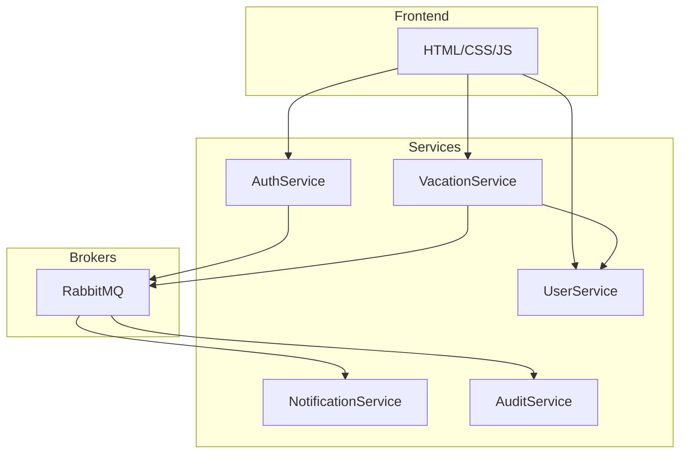

# Практична робота №4

**Виконали:** ІП-з31 Семен Прохода, Арсен Потеряйко

**Тема:** Event-driven архітектура.

**Мета:** Застосувати event-driven для проектування складних систем.

## Завдання:

### 1. Вкажіть use cases у вашій системі, які потребують event-driven архітектури.

- Після зміни статусу заявки на відпустку - відправлення повідомлень (NotificationService).

- Логування подій авторизації (AuditService) після успішного чи неуспішного логіну (AuthService).

- Синхронізація між сервісами через асинхронні події при зміні даних користувачів, заявок.

- Генерація звітів або оновлення статистики на основі подій у системі.

### 2. Вкажіть, які саме патерни event-driven архітектури використовуються.

| Патерн                                          | Опис                                                                                                          |
| ----------------------------------------------- | ------------------------------------------------------------------------------------------------------------- |
| Event-driven                                    | Взаємодія через події (events), які асинхронно передаються між сервісами через брокер повідомлень (RabbitMQ). |
| Publish-Subscribe                               | Сервіси публікують події, інші підписуються на них і обробляють.                                              |
| Event Sourcing                                  | Збереження послідовності подій для відновлення стану (опціонально для аналітики).                             |
| CQRS (Command Query Responsibility Segregation) | Розділення операцій запису і читання через події для підвищення продуктивності (можливо майбутня еволюція).   |

### 3. Вкажіть, які інструменти та технології використовуються та чому.

| Інструмент / Технологія | Причина використання                                            |
| ----------------------- | --------------------------------------------------------------- |
| RabbitMQ                | Надійний брокер повідомлень, підтримує черги та Pub/Sub патерн. |
| FastAPI                 | Легкий асинхронний фреймворк для реалізації сервісів.           |
| MySQL/SQLite            | Спільна база даних для всіх сервісів.                           |
| Docker                  | Контейнеризація та просте розгортання сервісів і брокера.       |

### 4. Оновіть діаграми.

### 5. Event-driven system PoC чи Stream processing PoC.
Створення події publish_user_registered:

    def publish_user_registered(user_id, email):
        connection = pika.BlockingConnection(pika.ConnectionParameters('localhost'))
        channel = connection.channel()
        channel.queue_declare(queue='user_registered')

        event = {
            'user_id': user_id,
            'email': email
        }

        channel.basic_publish(
            exchange='',
            routing_key='user_registered',
            body=json.dumps(event)
        )

        connection.close()

Підписка з іншого сервісу:

    def callback(ch, method, properties, body):
        event = json.loads(body)

        connection = pika.BlockingConnection(pika.ConnectionParameters('localhost'))
        channel = connection.channel()
        channel.queue_declare(queue='user_registered')

        channel.basic_consume(
            queue='user_registered',
            on_message_callback=callback,
            auto_ack=True
        )
    
    channel.start_consuming()