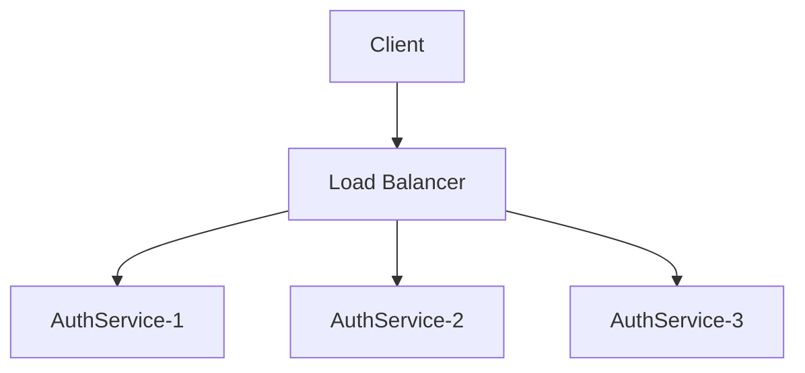
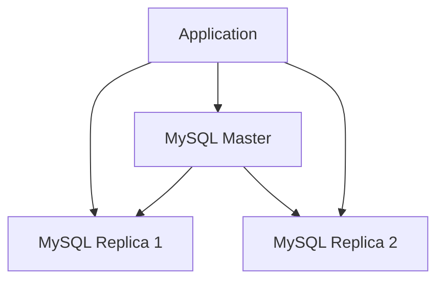

# Практична робота №5

**Виконали:** ІП-з31 Семен Прохода, Арсен Потеряйко

**Тема:** Масштабування системи

**Мета:** масштабувати кожен елемент системи

## Завдання:

### 1. Зробити високорівневий capacity planning для системи:

#### Припущення про навантаження:

- Організація: 500 користувачів
- Співвідношення ролей: 400 працівників, 80 менеджерів, 20 адміністраторів
- Пікове навантаження: 50% користувачів онлайн одночасно (250 користувачів)
- Заявки на відпустку: в середньому 2 заявки на користувача на рік

#### Розрахунки продуктивності:

| Компонент           | Один інстанс | Пікове навантаження        |
| ------------------- | ------------ | -------------------------- |
| AuthService         | 1000 RPS     | 50 RPS (автентифікація)    |
| UserService         | 800 RPS      | 100 RPS (профілі, списки)  |
| VacationService     | 500 RPS      | 150 RPS (заявки, календар) |
| NotificationService | 200 RPS      | 30 RPS (сповіщення)        |
| AuditService        | 300 RPS      | 20 RPS (логування)         |

#### База даних:

- MySQL: до 10,000 SELECT/s, 2,000 INSERT/UPDATE/s
- Наше навантаження: ~350 запитів/с в пік
- Резерв: 95% вільної потужності

#### RabbitMQ:

- Один брокер: до 50,000 повідомлень/с
- Наше навантаження: ~50 повідомлень/с
- Резерв: так

### 2. Вкажіть для кожного елементу системи, який тип масштабування буде використовуватись в кожному випадку:

#### a. мікросервіси

| Сервіс              | Тип масштабування           | Обґрунтування                        |
| ------------------- | --------------------------- | ------------------------------------ |
| AuthService         | Горизонтальне               | Stateless, легко реплікується        |
| UserService         | Горизонтальне               | CRUD операції, без стану             |
| VacationService     | Горизонтальне + Вертикальне | Найвище навантаження, складна логіка |
| NotificationService | Горизонтальне               | Асинхронна обробка, stateless        |
| AuditService        | Вертикальне                 | Переважно запис, менше навантаження  |

#### b. система обміну повідомленнями

**Тип:** Горизонтальне масштабування

- **Підхід:** RabbitMQ Cluster
- **Конфігурація:** 3 вузли в кластері
- **Реплікація:** Queue mirroring між вузлами

#### d. база даних(MySQL)

**Тип:** Вертикальне + Read Replicas

- **Вертикальне:** збільшення CPU, RAM, SSD
- **Read Replicas:** 2-3 репліки для читання
- **Шардінг:** за потреби (по організаціях)

### 3. Вкажіть причини, з яких ви застосовуєте масштабування взагалі і кожний тип масштабування зокрема.

#### Загальні причини:

- Зростання кількості користувачів (від 500 до 5000+)
- Підвищення доступності (99.9% uptime)
- Географічне розширення (різні часові пояси)
- Сезонні піки (планування відпусток на початок року)

#### Специфічні причини по типах:

##### Горизонтальне масштабування:

- Розподіл навантаження між інстансами
- Відмовостійкість (fault tolerance)
- Гнучкість в додаванні ресурсів

##### Вертикальне масштабування:

- Простіша архітектура (менше мережевих викликів)
- Ефективно для CPU/memory-intensive задач
- Підвищення продуктивності одного інстанса

### 4. Вказати для кожного елементу системи, як відбувається балансування навантаження у випадку горизонтального масштабування (як відбувається диспетчеризація)

#### Мікросервіси

**Load Balancer:** NGINX



**Алгоритми балансування:**

- **Round Robin** - для AuthService, UserService
- **Least Connections** - для VacationService
- **IP Hash** - для сесійних даних

#### RabbitMQ Cluster

**Підхід:** Client-side балансування

- Конфігурація з кількома вузлами

```python
connection_params = [
    pika.ConnectionParameters('rabbitmq-1'),
    pika.ConnectionParameters('rabbitmq-2'),
    pika.ConnectionParameters('rabbitmq-3')
]
```

#### База даних

**Read Replicas балансування:**



**Стратегія:**

- **Запис:** тільки Master
- **Читання:** балансування між репліками
- **Алгоритм:** Weighted Round Robin
