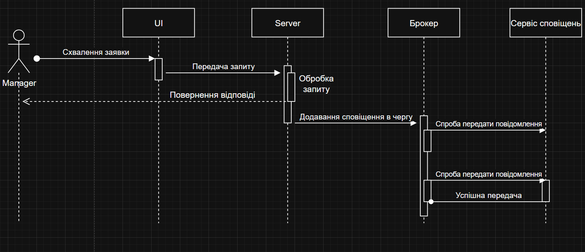

# Практична робота №6

**Виконали:** ІП-з31 Семен Прохода, Арсен Потеряйко

**Тема:** Забезпечення відмовостійкості та надійності системи.

**Мета:** Навчитись передбачати потенційні проблеми системи на етапі формування технічних вимог, та приймати рішення, щодо їх коректної обробки.

## Завдання:

### 1. Скласти список ключових потенційних відмов системи.

- Доступ робітник до адмінських або менеджерських функцій.

- Надсилання дубліката заявки (один робітник надсилає декілька заяв).

- Відсутні або некоректні дані в заявці.

- Адмін намагається підтвердити вже прийняту/відхилену заявку.

### 2. Вибрати по 1 проблемі на студента, та описати 2-3 варіанти рішення цих проблем

- Проблема: Менеджер намагається підтвердити вже прийняту/відхилену заявку

  Опис:  
  Якщо заявка вже має статус "підтверджено" або "відхилено", менеджер все ще може намагатися змінити її статус повторно. Це може спричинити логічні помилки, дублювання або плутанину в системі.

  Варіанти вирішення:
  1. Перевірка статусу перед обробкою:  
     Перед зміною статусу перевіряти, чи він дорівнює "pending". Якщо ні — блокувати дію та виводити повідомлення про помилку.
  2. Обмеження через UI:  
     У користувацькому інтерфейсі приховати або деактивувати кнопки "Підтвердити" та "Відхилити" для оброблених заявок.
  3. Історія змін:  
     Додавання системи журналу змін, яка фіксує всі зміни статусів без можливості їх перезапису. У разі помилки — створюється нова заявка з прив’язкою до попередньої.

- Проблема: Доступ робітник до адмінських або менеджерських функцій

  Опис:  
  Користувач із роллю "робітник" може спробувати вручну отримати доступ до функцій для адміністратора або менеджера через URL, API-запити тощо.

  Варіанти вирішення:
  1. Перевірка прав на сервері:  
     Реалізувати рольову модель контролю доступу. Кожен запит перевіряється — якщо роль не дозволяє дію, повертається помилка 403 Forbidden.
  2. UI-фільтрація:  
     У клієнтському інтерфейсі приховати кнопки та сторінки, які не призначені для поточної ролі користувача.
  3. Аудит безпеки:  
     Логувати спроби доступу до заборонених функцій. За багаторазові порушення — надсилати повідомлення адміну або тимчасово блокувати обліковий запис.

### 3. Обрати рішення проблеми, та обґрунтувати з точки зору бізнесу  (врахувати пріоритети, час виконання, ресурси, вартість і т.д.).

- Проблема: Менеджер намагається підтвердити вже оброблену (прийняту або відхилену) заявку

  Рішення:  
  У такому випадку доцільно реалізувати перевірку статусу заявки перед обробкою. Перед зміною статусу система повинна перевіряти, чи є поточний статус "Очікує на розгляд" (наприклад, "pending"). Якщо статус відрізняється, дія має бути заблокована з відповідним повідомленням для адміністратора:  
  “Цю заявку вже було оброблено.”  
  Таке рішення є простим у реалізації, не потребує значних ресурсів та ефективно запобігає дублюванню або логічним помилкам у роботі з заявками.

- Проблема: Працівник отримує несанкціонований доступ до функцій адміністратора або менеджера

  Рішення:  
  Найоптимальнішим підходом є впровадження чіткої рольової системи розмежування доступу. Кожна дія в системі повинна перевіряти роль користувача та дозволяти виконання лише тим, хто має відповідні права доступу.  
  Це критично важлива функціональність, оскільки система повинна бути захищена від маніпуляцій, таких як самостійне погодження власної відпустки працівником.  
  Хоча реалізація повноцінної системи ролей може потребувати більше часу та ресурсів, її важливість для безпеки, стабільності та цілісності системи дуже висока. Така система не тільки унеможливлює несанкціонований доступ, але й забезпечує масштабованість платформи в майбутньому.

### 4. Описати діаграму послідовностей (sequence diagram) для проблем.

### 5. Вкажіть, які патерни вокористовуються.

### Використані патерни проєктування

- Патерн: Role-Based Access Control (RBAC)

  Опис:  
  Патерн керування доступом на основі ролей (RBAC) дозволяє обмежити виконання певних дій залежно від ролі користувача в системі. Кожен користувач має одну або кілька ролей (наприклад: "employee", "manager", "admin"), і ці ролі визначають доступ до функціональності.

  Застосування в системі:  
  - Звичайні працівники можуть лише створювати заявки (на вступ або відпустку), але не мають доступу до їх погодження.
  - Менеджери можуть переглядати та затверджувати/відхиляти заявки на відпустку.
  - Адміністратор має розширені права: підтвердження вступу, призначення менеджерів тощо.

  Переваги:
  - Підвищена безпека: кожна роль має чітко обмежений набір дозволених дій.
  - Гнучкість: легко розширювати або змінювати права ролей без зміни основного коду.
  - Масштабованість: зручно додавати нові рівні доступу при розширенні системи.

  Приклад перевірки:
  При обробці запиту сервер перевіряє роль користувача, перш ніж виконати дію. Якщо роль не дозволяє операцію — повертається помилка 403 "Access denied".